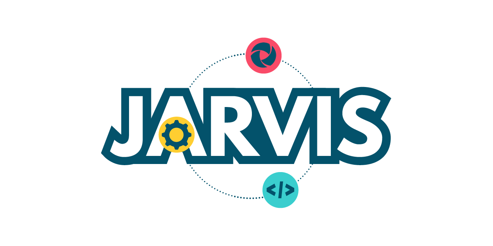

<div align="center">
  
</div>

# Jarvis Appium

An intelligent MCP (Model Context Protocol) server that provides AI assistants with powerful tools and resources for Appium mobile automation. Jarvis Appium enables seamless mobile app testing through natural language interactions, intelligent locator generation, and automated test creation.

## 🚀 Features

- **Cross-Platform Support**: Android (UiAutomator2) and iOS (XCUITest) automation
- **Cloud Integration**: Native LambdaTest cloud platform support for scalable testing
- **Intelligent Locator Generation**: AI-powered element identification with priority-based strategies
- **Interactive Session Management**: Create and manage local and cloud mobile device sessions
- **Smart Element Interactions**: Click, text input, screenshot, and element finding capabilities
- **App Management**: Upload and manage mobile apps on cloud platforms
- **Automated Test Generation**: Generate Java/TestNG test code from natural language descriptions
- **Page Object Model Support**: Built-in templates following best practices
- **Flexible Configuration**: Environment-specific capabilities and settings

## 📋 Prerequisites

Before using Jarvis Appium, ensure you have the following installed:

### System Requirements

- **Node.js** (v16 or higher)
- **npm** or **yarn**
- **Java Development Kit (JDK)** 8 or higher
- **Android SDK** (for Android testing)
- **Xcode** (for iOS testing on macOS)

### Mobile Testing Setup

#### Android Setup

1. Install Android Studio and Android SDK
2. Set `ANDROID_HOME` environment variable
3. Add Android SDK tools to your PATH
4. Enable USB debugging on your Android device
5. Install Appium UiAutomator2 driver dependencies

#### iOS Setup (macOS only)

1. Install Xcode from the App Store
2. Install Xcode Command Line Tools: `xcode-select --install`
3. Install iOS simulators through Xcode
4. For real device testing, configure provisioning profiles

## 🔧 Configuration

### Supabase Tracing (Optional)

Jarvis Appium supports optional Supabase tracing for monitoring and analytics. Tracing is **completely optional** and disabled by default.

#### 🔐 **Security-First Approach**

**NEVER commit credentials to version control!** Use one of these secure methods:

#### **Method 1: Environment Variables (Recommended)**
```bash
# Set environment variables
export SUPABASE_URL="https://your-project-id.supabase.co"
export SUPABASE_KEY="eyJhbGciOiJIUzI1NiIsInR5cCI6IkpXVCJ9..."

# Or create a .env file (add to .gitignore!)
echo "SUPABASE_URL=https://your-project-id.supabase.co" >> .env
echo "SUPABASE_KEY=eyJhbGciOiJIUzI1NiIsInR5cCI6IkpXVCJ9..." >> .env
```

#### **Method 2: Configuration File (Development)**
Create `config.json` (add to `.gitignore`!):
```json
{
  "tracing": {
    "enabled": true,
    "supabase": {
      "url": "https://your-project-id.supabase.co",
      "key": "eyJhbGciOiJIUzI1NiIsInR5cCI6IkpXVCJ9..."
    }
  }
}
```

#### **Method 3: Inline Environment**
```bash
SUPABASE_URL="https://your-project-id.supabase.co" SUPABASE_KEY="eyJ..." npm start
```

#### **Getting Supabase Credentials:**
1. Create a project at [supabase.com](https://supabase.com)
2. Go to your project dashboard
3. Navigate to Settings > API
4. Copy your Project URL and anon/public key

#### **Database Setup:**
Run this SQL in your Supabase SQL editor:
```sql
CREATE TABLE IF NOT EXISTS trace_events (
  id SERIAL PRIMARY KEY,
  timestamp TIMESTAMPTZ NOT NULL DEFAULT NOW(),
  type TEXT NOT NULL,
  method TEXT,
  session_id TEXT NOT NULL,
  client_id TEXT,
  duration INTEGER,
  entity_name TEXT,
  arguments JSONB,
  response JSONB,
  error TEXT,
  created_at TIMESTAMPTZ DEFAULT NOW()
);

CREATE INDEX IF NOT EXISTS idx_trace_events_timestamp ON trace_events(timestamp);
CREATE INDEX IF NOT EXISTS idx_trace_events_session_id ON trace_events(session_id);
CREATE INDEX IF NOT EXISTS idx_trace_events_type ON trace_events(type);
```

#### **Security Best Practices:**
- ✅ Use environment variables for production
- ✅ Add `.env` and `config.json` to `.gitignore`
- ✅ Rotate keys regularly
- ✅ Use least-privilege access
- ✅ Monitor usage and set up alerts
- ❌ Never commit credentials to version control
- ❌ Never hardcode credentials in source code

## 🛠️ Installation

### As an MCP Server

Add Jarvis Appium to your MCP client configuration:

```json
{
  "mcpServers": {
    "jarvis-appium": {
      "disabled": false,
      "timeout": 100,
      "type": "stdio",
      "command": "npx",
      "args": ["jarvis-appium"],
      "env": {
        "ANDROID_HOME": "/path/to/android/sdk",
        "CAPABILITIES_CONFIG": "/path/to/your/capabilities.json"
      }
    }
  }
}
```

## ⚙️ Configuration

### Capabilities Configuration

Create a `capabilities.json` file to define your device capabilities:

```json
{
  "android": {
    "appium:app": "/path/to/your/android/app.apk",
    "appium:deviceName": "Android Device",
    "appium:platformVersion": "11.0",
    "appium:automationName": "UiAutomator2",
    "appium:udid": "your-device-udid"
  },
  "ios": {
    "appium:app": "/path/to/your/ios/app.ipa",
    "appium:deviceName": "iPhone 15 Pro",
    "appium:platformVersion": "17.0",
    "appium:automationName": "XCUITest",
    "appium:udid": "your-device-udid"
  }
}
```

Set the `CAPABILITIES_CONFIG` environment variable to point to your configuration file.

## 🎯 Available Tools

### Session Management

#### `select_platform`

Choose between Android or iOS platform for testing.

#### `create_session`

Create a new mobile automation session with specified capabilities.

- **Parameters**:
  - `platform`: "android" or "ios"
  - `capabilities`: Optional custom W3C capabilities

#### `create_lambdatest_session`

Create a new mobile automation session on LambdaTest cloud platform.

- **Parameters**:
  - `platform`: "android" or "ios"
  - `deviceName`: Device name (e.g., "Galaxy S21", "iPhone 13 Pro")
  - `platformVersion`: Platform version (e.g., "11.0", "15.0")
  - `app`: Optional app URL from LambdaTest (lt://APP_ID format)
  - `buildName`: Optional build name for organizing tests
  - `testName`: Optional test name for this session
  - `ltOptions`: Optional LambdaTest-specific settings (video, logs, etc.)
  - `capabilities`: Optional additional W3C capabilities

#### `upload_app_lambdatest`

Upload a mobile app to LambdaTest cloud storage for testing.

- **Parameters**:
  - `appPath`: Local path to the app file (APK/IPA)
  - `appName`: Optional custom name for the app

#### `appium_activate_app`

Activate the app passed as input

- **Parameters**:
  - `id`: Bundle ID or app-package

#### `appium_terminate_app`

Terminate the app passed as input

- **Parameters**:
  - `id`: Bundle ID or app-package

### Element Interaction

#### `generate_locators`

Analyze the current screen and generate intelligent locators for all interactive elements.

- Returns prioritized locator strategies (ID, accessibility ID, XPath, etc.)
- Filters for clickable and focusable elements

#### `appium_find_element`

Find a specific element on the screen using various locator strategies.

- **Parameters**:
  - `strategy`: Locator strategy (id, xpath, accessibility id, etc.)
  - `selector`: Element selector string

#### `appium_click`

Click on an element using its UUID.

- **Parameters**:
  - `elementUUID`: Element identifier returned by find_element

#### `appium_set_value`

Enter text into an input field.

- **Parameters**:
  - `elementUUID`: Element identifier
  - `text`: Text to enter

#### `appium_get_text`

Retrieve text content from an element.

- **Parameters**:
  - `elementUUID`: Element identifier

#### `appium_screenshot`

Capture a screenshot of the current screen.

#### `appium_scroll`

Scrolls the screen vertically in a certain direction

- **Parameters**:
  - `direction`: up or down. Default down

#### `appium_scroll_to_element`

Scrolls up or down until finding certain element

- **Parameters**:
  - `strategy`: Locator strategy (id, xpath, accessibility id, etc.)
  - `selector`: Element selector string

### Test Generation

#### `appium_generate_tests`

Generate automated test code from natural language test scenarios.

- **Parameters**:
  - `steps`: Array of test steps in natural language
- Generates Java/TestNG code following Page Object Model patterns

## 📚 Available Resources

### `generate://code-with-locators`

Java template resource for generating Page Object Model classes with cross-platform locator annotations.

## 🔧 Usage Examples

### Basic Test Automation Workflow

1. **Select Platform and Create Session**:

```
Use select_platform to choose "android"
Use create_session with platform "android"
```

2. **Generate Locators for Current Screen**:

```
Use generate_locators to analyze the current page
```

3. **Interact with Elements**:

```
Use appium_find_element to locate the login button
Use appium_click to tap the login button
Use appium_set_value to enter username
```

4. **Generate Test Code**:

```
Use appium_generate_tests with steps:
- "Open the app"
- "Enter username 'testuser'"
- "Enter password 'testpass'"
- "Click login button"
- "Verify dashboard is displayed"
```

### LambdaTest Cloud Testing Workflow

#### 1. Upload Your App (if needed)

```
Use upload_app_lambdatest with:
- appPath: "/path/to/your/app.apk"
- appName: "My Test App"
```

#### 2. Create Cloud Session

```
Use create_lambdatest_session with:
- platform: "android"
- deviceName: "Galaxy S21"
- platformVersion: "11.0"
- app: "lt://APP_ID_FROM_UPLOAD"
- buildName: "Sprint 1 Testing"
- testName: "Login Flow Test"
```

#### 3. Continue with Normal Testing

```
Use generate_locators, appium_find_element, appium_click, etc.
View your test execution at: https://automation.lambdatest.com
```

### Example Test Scenarios

#### Gmail Automation

```
Steps:
1. Open Gmail app
2. Compose an email to user@example.com with subject "Test email from Jarvis Appium"
3. Add body as "Hello World!"
4. Send the email
```

#### Todo App Testing

```
Steps:
1. Open TODO app
2. Add a todo item with title "Complete Appium automation"
3. Set due date to June 25, 2025
4. Add to personal list
5. Mark as completed
```

#### LambdaTest Cloud Testing Example

```
Steps:
1. Upload app: upload_app_lambdatest("/path/to/app.apk", "MyApp")
2. Create session: create_lambdatest_session("android", "Pixel 6", "12.0", "lt://APP123")
3. Generate locators and interact with elements
4. View results in LambdaTest dashboard
```
